# [roastme.ru](https://roastme.ru)

"Roastme" project aim to unite developers willing to create. It is list of manually picked news about programming, AI, contries legislations, digital nomands, SaaS instruments, github repositories... with precise enumeration of entities mentioned in this news for faster understanding does this news deserve attention or must be roasted. It helps to discover new things just before you think of.

## Hub project
https://github.com/woto/hub
## Google chrome Extenstion (this repo)
https://github.com/woto/extension

## Context menu
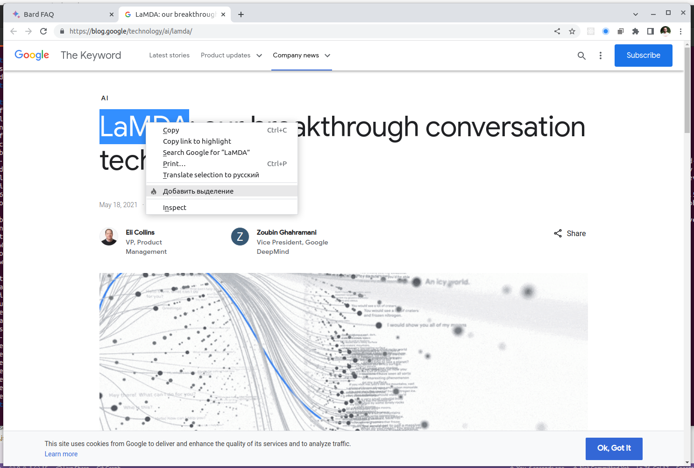

## Wikipedia
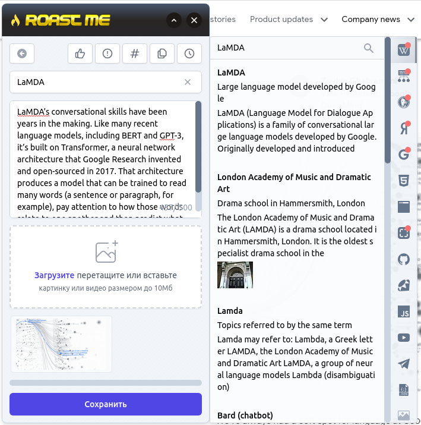

## Google Graph
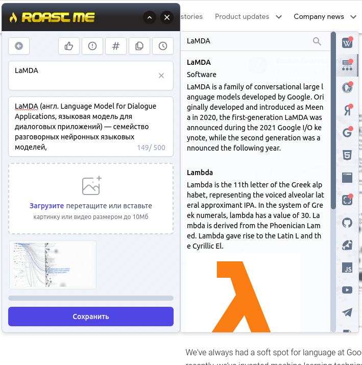

## Duck Duck Go
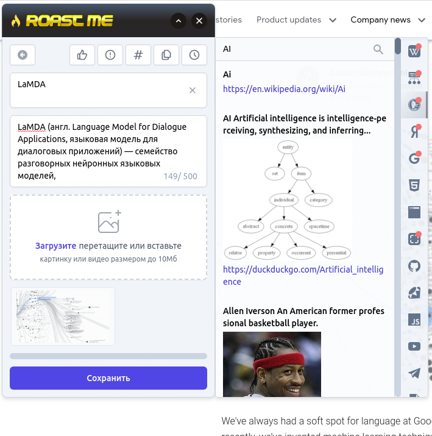

## Yandex
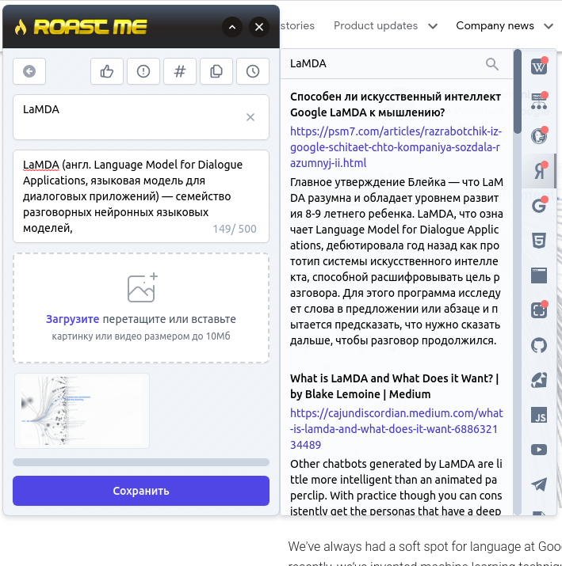

## Google
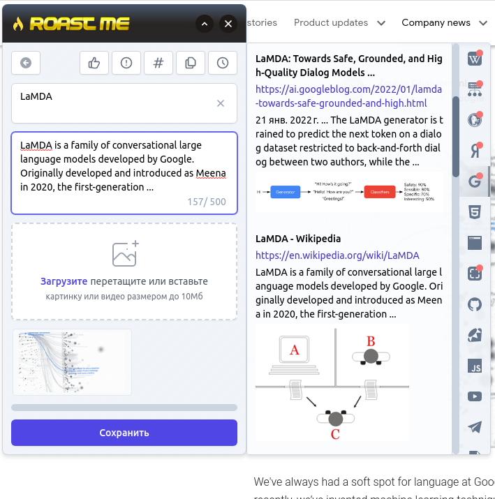

## RDFa, Microdata, JSON-LD
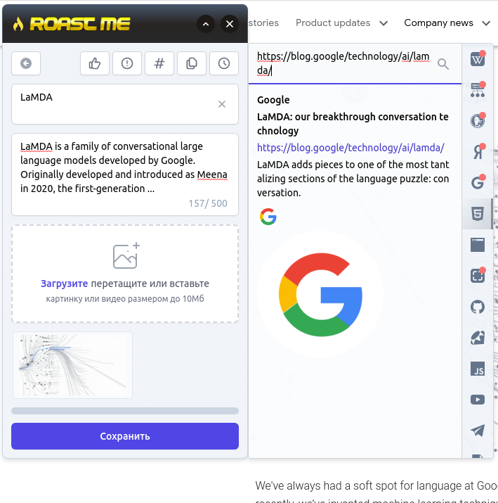

## Scrape
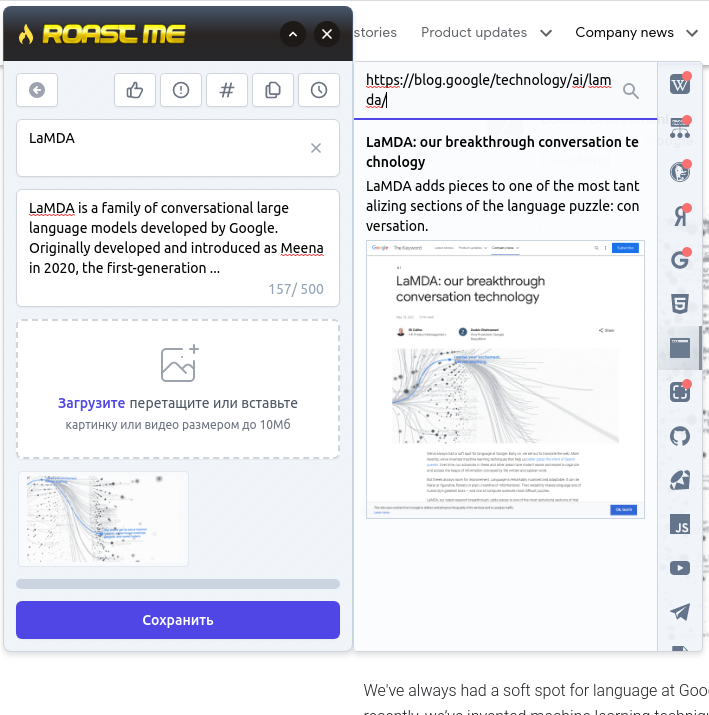

## Screenshot
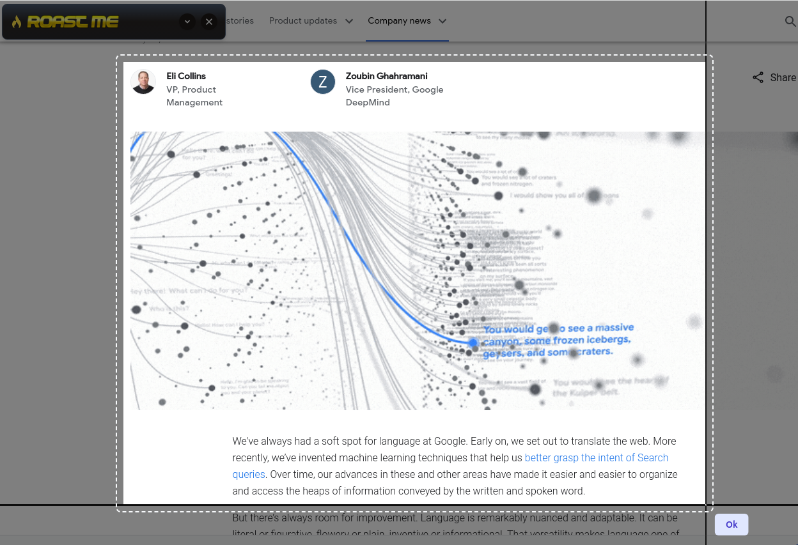

## Github
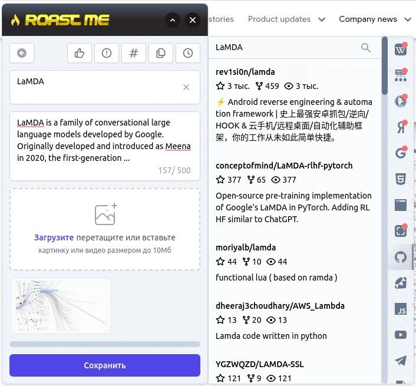

## Rubygems
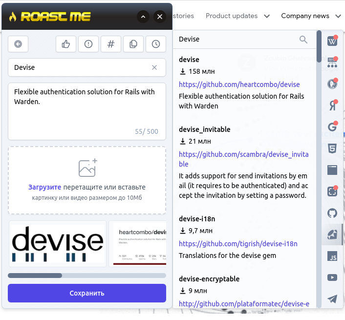

## NPM
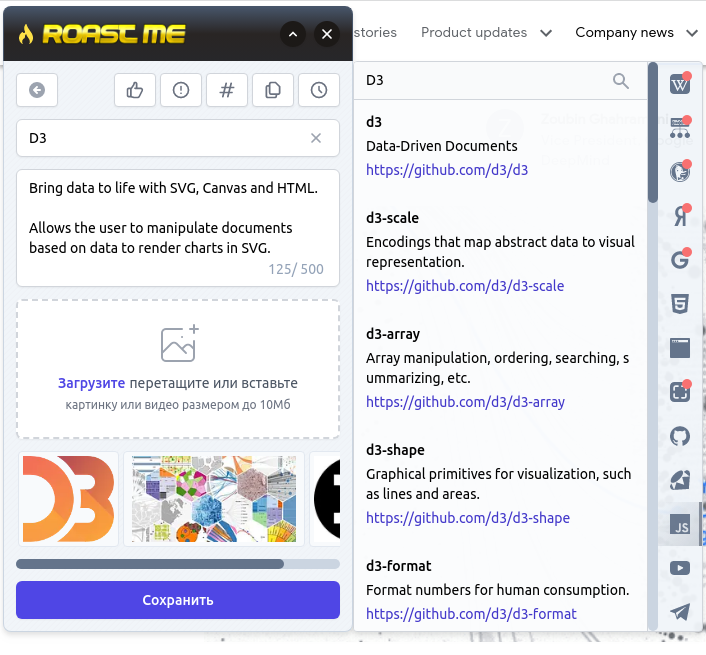

## Youtube
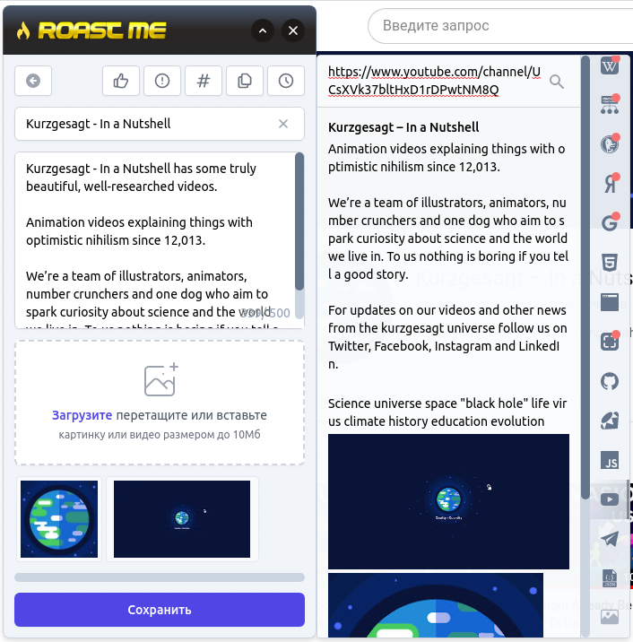

## Telegram
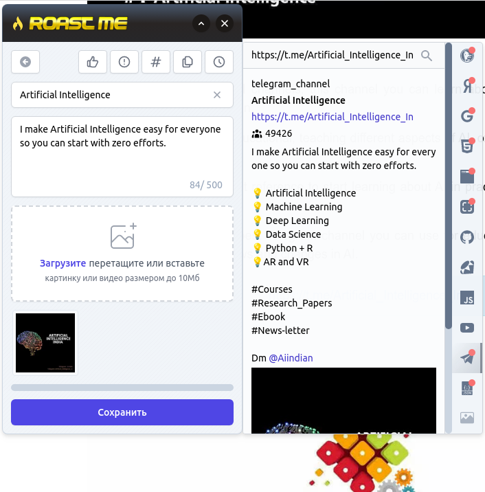

## Raw metadata
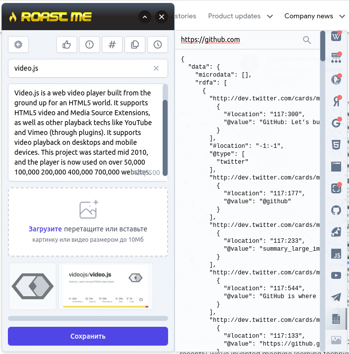

## Sentiment
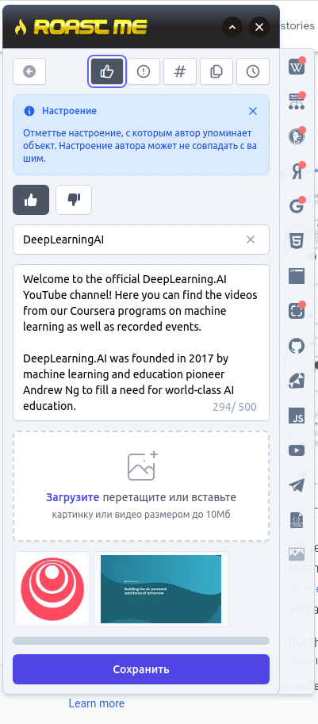

## Synonyms
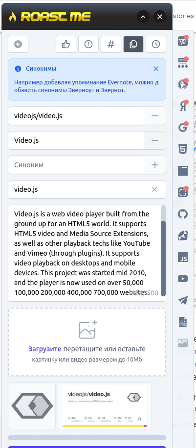

## Tags
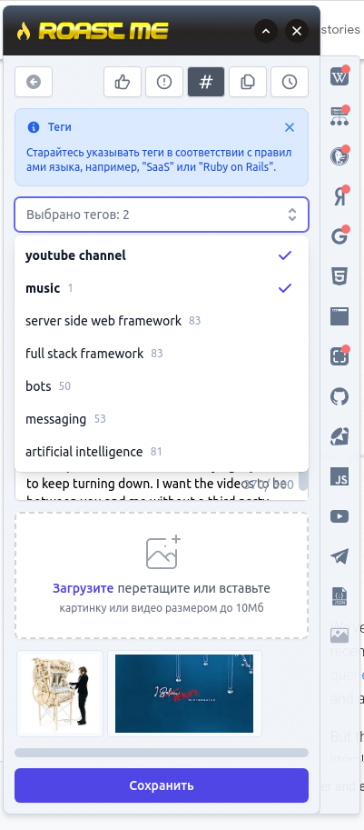

## Publication date
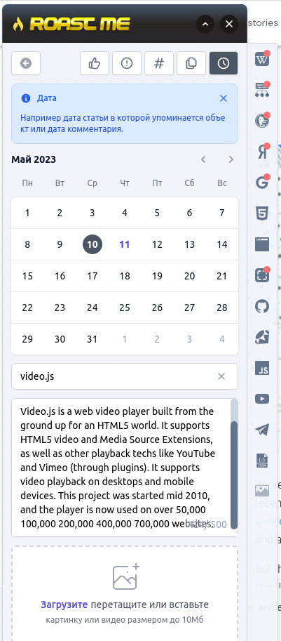

## Priority
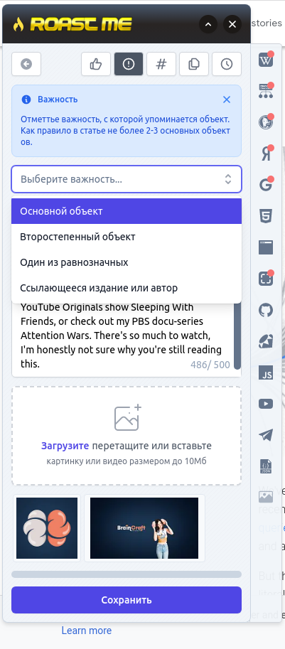
